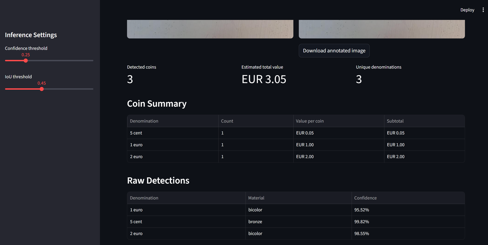
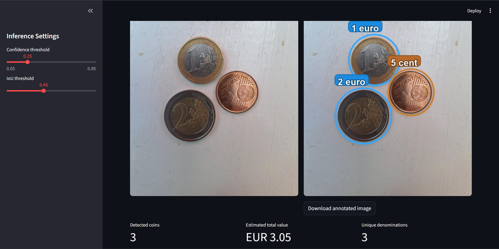
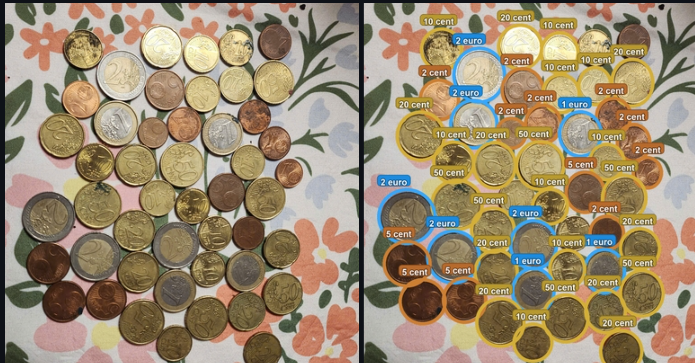
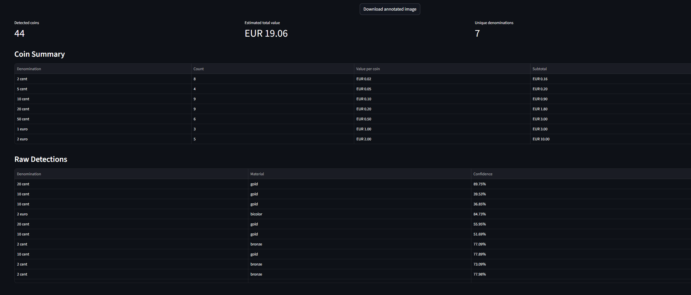
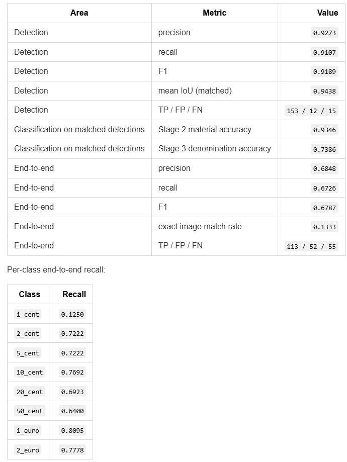

# eurocoin-vision

`eurocoin-vision` is a deep learning pipeline for euro coin detection and denomination recognition from a single image.

It is a personal DL reinterpretation of the classical CV project [Image_projet_money](https://github.com/sorooshaghaei/Image_projet_money) from the M1 Vision et Machine Intelligente program (Universite Paris Cite).

## 2026-03-15 Model Refresh

New weights are now published for all stages.

The major quality regression from the previous cycle was traced to two data issues:

- incorrect annotations in a subset of dataset labels
- inconsistent image orientation caused by EXIF rotation metadata in part of the dataset

The dataset was corrected and retrained. Dataset export now explicitly normalizes EXIF orientation during preparation (`ImageOps.exif_transpose`) so label geometry and pixel content stay aligned.

Why the quality drop was severe:

- wrong labels injected direct supervision noise (the model was optimized toward incorrect targets)
- EXIF rotation mismatches broke box/crop alignment for a subset of samples (pixel content and label geometry disagreed)
- both issues compounded across stages, so detection/crop errors propagated into material and denomination classification

## Latest Results

Source: `ml_pipeline/results/evaluation_report_20260315_160709.json`

| Area | Metric | Value |
| --- | --- | ---: |
| Stage 1 detector | mAP50 | `0.9950` |
| Stage 1 detector | mAP50-95 | `0.9251` |
| Stage 2 material (GT crops) | accuracy | `0.9219` |
| Stage 3 denomination (hierarchical, GT crops) | accuracy | `0.8232` |
| End-to-end | precision | `0.7866` |
| End-to-end | recall | `0.7866` |
| End-to-end | F1 | `0.7866` |
| End-to-end | exact image match rate | `0.3333` |

## Pipeline

Three-stage architecture:

1. `YOLOv8` coin detector (`stage1`)
2. `ResNet18` material classifier (`stage2`: bronze / gold / bicolor)
3. material-specific `ResNet18` denomination classifiers (`stage3_bronze`, `stage3_gold`, `stage3_bicolor`)

## Visual Examples







Reminder: refresh `assets/screenshots/04_evaluation_metrics.png` using the latest report values from `ml_pipeline/results/evaluation_report_20260315_160709.json`.

## Tech Stack

- Python
- Ultralytics YOLOv8
- PyTorch + Torchvision (`ResNet18`)
- Pillow + NumPy
- PyYAML
- Streamlit

## Data and Weights

- Dataset: [Hugging Face - 3v3r51nc3/eurocoin-vision-dataset](https://huggingface.co/datasets/3v3r51nc3/eurocoin-vision-dataset)
- Weights: `model_weights/` in this repository and [GitHub Releases](https://github.com/3v3r51nc3/eurocoin-vision/releases/)
- Current refreshed weight set: aligned with `ml_pipeline/results/evaluation_report_20260315_160709.json` (`2026-03-15`).

## Quick Start

1. Install dependencies:

```bash
pip install -r requirements.txt
```

2. Place raw dataset files under `ml_pipeline/data_raw/`:

- `images/`
- `labels/`
- `notes.json`

3. Place model checkpoints under `model_weights/`:

- `stage1/stage1_yolov8n_best.pt`
- `stage2/stage2_resnet18_checkpoint.pt`
- `stage3/stage3_resnet18_hierarchical.yaml`
- `stage3_bronze/stage3_resnet18_bronze_checkpoint.pt`
- `stage3_gold/stage3_resnet18_gold_checkpoint.pt`
- `stage3_bicolor/stage3_resnet18_bicolor_checkpoint.pt`

4. Regenerate prepared datasets (applies annotation + EXIF-safe export path):

```bash
python ml_pipeline/prepare_datasets.py
```

5. Run the Streamlit app:

```bash
streamlit run main.py
```

## Full Documentation

See [PROJECT_DETAILS.md](PROJECT_DETAILS.md) for full technical details, training/evaluation notes, and detailed per-stage metrics.
